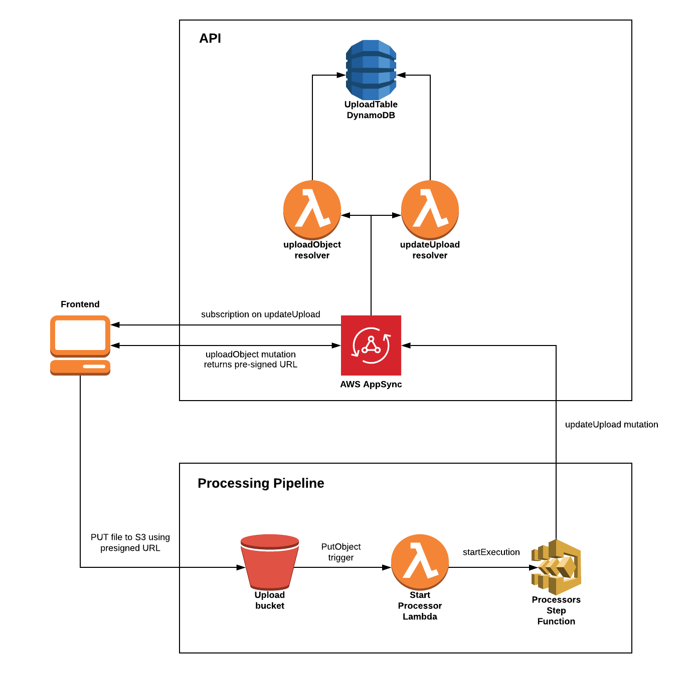
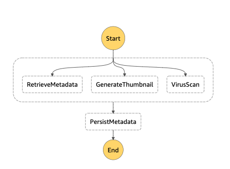

# Serverless File Upload Backend

Serverless backend for uploading files to S3 via a GraphQL API.

## Requirements

* Python3
* AWS CLI already configured with Administrator permission
* SAM CLI
* [nodejs10.x](https://nodejs.org/en/download/releases/)
* [Docker](https://www.docker.com/community-edition)
* Typescript

## Overview and Architecture



#### Processing State Machine



## Development

- GraphQL schema to Typescript type generation is used with [graphql-schema-typescript](https://github.com/dangcuuson/graphql-schema-typescript)  
- Files are uploaded with `Content-Type: application/octet-stream` which represents an unknown binary file  

## Testing uploads

There is a python script for uploading a file to S3 using the pre-signed URL.

First, make an `uploadObject` mutation via the AWS AppSync console.
Add the pre-signed URL from the mutation response to the python script and run:

```
python3 uploader.py
```

## Packaging and deployment

An S3 bucket must be created before deployment to hold the lambda code:

```bash
aws s3 mb s3://BUCKET_NAME
```

Set the follow environment variables:
```bash
export S3_BUCKET=appsync-upload-api-bucket
export STACK_NAME=appsync-upload-api
```

```bash
# Build and test during development
make

# Build, Package and Deploy
make deploy-stack
```

Individual lambda functions can be tested using the SAM CLI:
```bash
# Updates the handler.zip lambda package that SAM references
make local-package

sam local invoke <LAMBDA_FUNCTION_NAME>
```

#### Packaging notes:
- The `devDependencies` are installed in order for `tsc` to compile the TypeScript code to Javascript
- The dev `node_modules` are then removed and the production dependencies are installed and zipped in the lambda package
